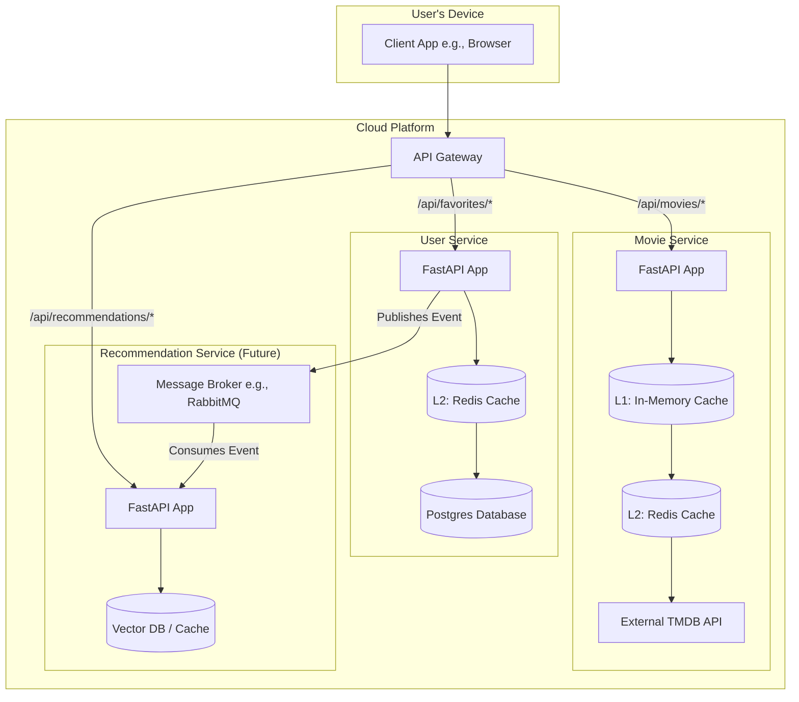

# High Level Overview

```mermaid
graph TD
    subgraph "User's Device"
        Client[Client App e.g., Browser]
    end

    subgraph "Cloud Platform"
        API_Gateway[API Gateway]

        subgraph "Movie Service"
            Movie_API[FastAPI App]
            L1_Cache_Movie[(L1: In-Memory Cache)]
            L2_Cache_Movie[(L2: Redis Cache)]
            TMDB_API[External TMDB API]
        end

        subgraph "User Service"
            User_API[FastAPI App]
            Postgres_DB[(Postgres Database)]
            L2_Cache_User[(L2: Redis Cache)]
        end

        subgraph "Recommendation Service (Future)"
            Reco_API[FastAPI App]
            Message_Broker[Message Broker e.g., RabbitMQ]
            Reco_DB[(Vector DB / Cache)]
        end
    end

    Client --> API_Gateway
    API_Gateway -->|/api/movies/*| Movie_API
    API_Gateway -->|/api/favorites/*| User_API
    API_Gateway -->|/api/recommendations/*| Reco_API

    Movie_API --> L1_Cache_Movie --> L2_Cache_Movie --> TMDB_API
    User_API --> L2_Cache_User --> Postgres_DB

    User_API -- Publishes Event --> Message_Broker
    Message_Broker -- Consumes Event --> Reco_API
    Reco_API --> Reco_DB
```